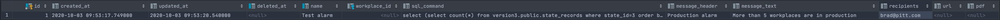
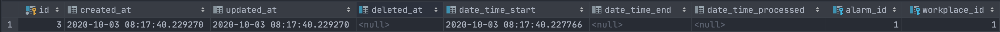

[](https://www.jetbrains.com/go/)
<br/>

[](https://github.com/petrjahoda/alarm_service/commits/master)
[](https://github.com/petrjahoda/alarm_service/issues)
<br/>


<br/>
[](https://hub.docker.com/r/petrjahoda/alarm_service)
[](https://hub.docker.com/r/petrjahoda/alarm_service/tags)
<br/>
[](https://www.postgresql.org) [](https://www.docker.com)

# Alarm Service
## Description
Go service, that check for alarms and do proper action when alarms are active.

## Installation Information
Install under docker runtime using [this dockerfile image](https://github.com/petrjahoda/system/tree/master/latest) with this command: ```docker-compose up -d```

## Implementation Information
Check the software running with this command: ```docker stats```. <br/>
Terminal_service has to be running.

## Additional information
- working with alarms in  ```alarms``` table
- creates and updates alarm records in ```alarm_records``` table
- in alarms_table recipients has to be delimited by "," or ";"
- result of sql query has to be in one column named result with 4 possible outcomes
    - true => alarm result is ON
    - false => alarm result is OFF
    - something (string, number, ...) => alarm result is ON
    - nothing (epmty) => alarm result is OFF

## Example of sql queries
- Creates alarm_record at the beginning of 12:00 on Saturday
    - only on this day and hour, alarm is ON, alarm_record is created at the beginning "true period"
    - on another hour and day, alarm is OFF, alarm_record is closed at the beginning of "false period"
```sql
select to_char(now(), 'Day') like '%Saturday%' and extract(hour from now()) = 12 as result
```
- Creates alarm when more than 5 workplaces are in production
    - when 6 or more workplaces are in production, alarm_record is created
    - when 5 and less workplace are in production, alarm_record is closed
```sql
select (select count (state_id) from (select workplace_id, state_id, max(date_time_start) as date_time_start from state_records group by workplace_id, state_id order by workplace_id)as final where state_id = 1) > 15 as result;
```

Alarms example


Alarm Records example


© 2020 Petr Jahoda
